# Image Hosting API

Image Hosting API

## Settings

Moved to [settings](http://cookiecutter-django.readthedocs.io/en/latest/settings.html).

## Getting started with Image Hosting API

Git clone and enter the repo

        $ cd IMAGE_HOSTING_API

Install direnv for environment variables setup

        $ brew install direnv

Then run

        $ direnv allow

Setup Virtualenv and activate

        $ virtualenv image_hosting
        $ source image_hosting/bin/activate

Build and Run Project

        $ docker-compose build
        $ docker-compose up

Create a superuser

        $ docker-compose run --rm django python manage.py createsuperuser

---

The Project creates the 3 base Plans required for the Image Hosting API out-of-the-box

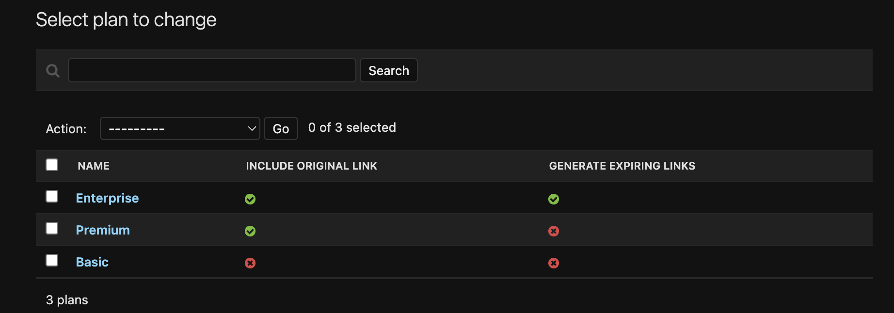

Create users for Image Hosting API

- Go to built in sign up form at http://127.0.0.1:8000/accounts/signup/ and enter Email Address and Password
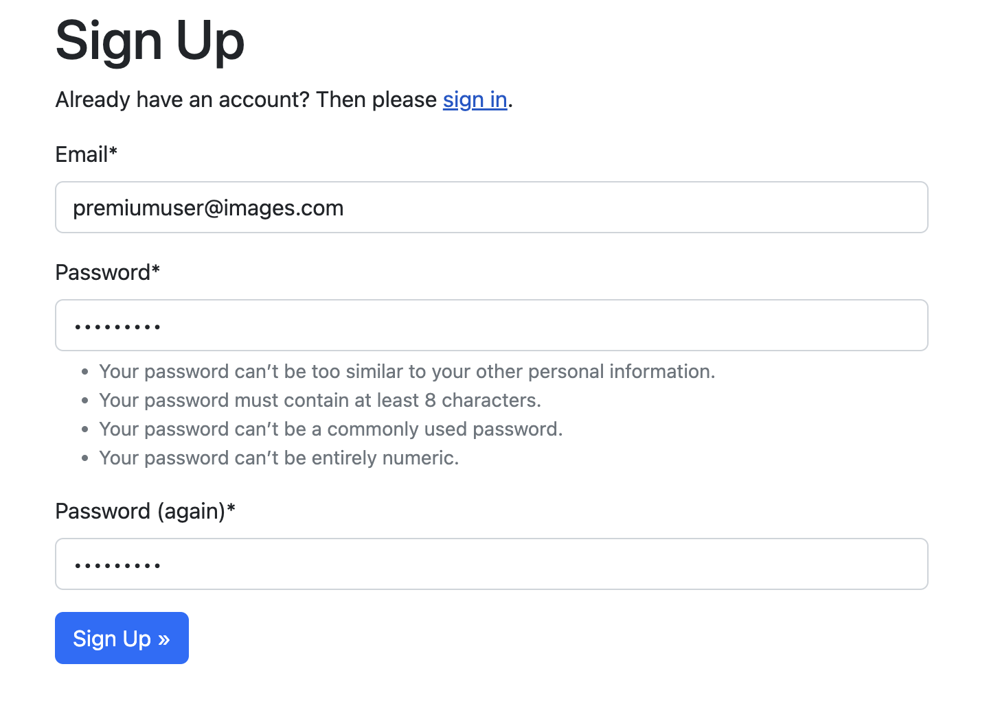

- Check the sample email in the docker django console and click on the link to verify (You can alternatively do this directly from Django-Admin as a superuser)
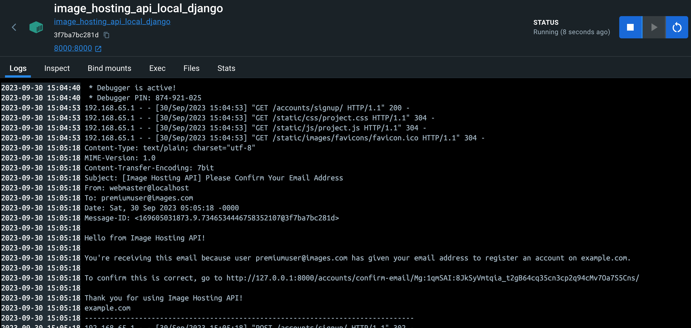

- Once you click on the link you will be forwarded to a confirm email verification form, click confirm to be able to login and access the Images API
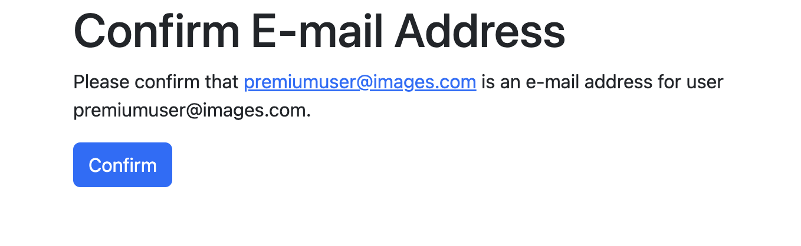

Create UserPlans for these created users from Django Admin

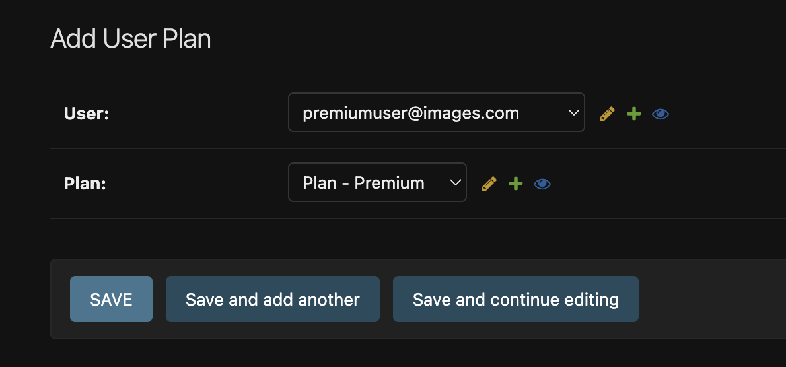

Signing in to access Image Hosting API

- Go to http://127.0.0.1:8000/accounts/login/ and enter the Email Address and Password from the step above. (Make sure you verify Email Address before this step)
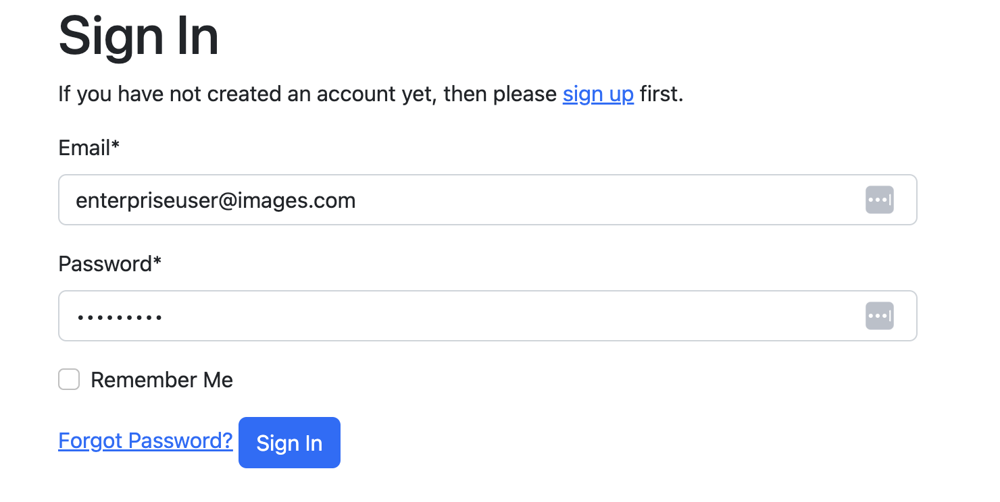
 - The login form will give you feedback that you logged in successfully
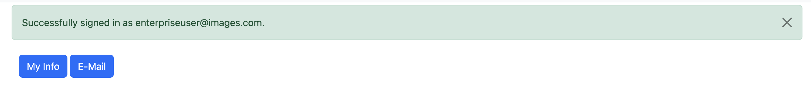

---

## Image Upload Endpoint with Browsable DRF

Make sure you login prior to this step

- Go to http://127.0.0.1:8000/api/images/ and you will see a DRF browsable form taking Title, Image, and Optionally Expiry in seconds (only if your plan allows this)
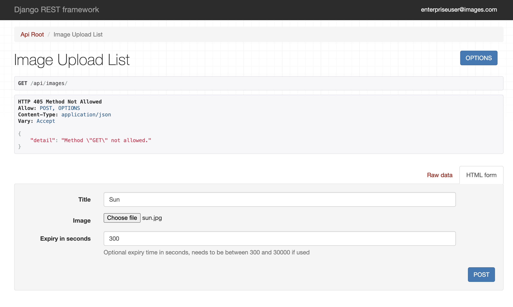
- Once you POST the request, you will see a response with title, expiry_in_seconds (if plan allows), original_image which can be expired if requested (if plan allows), and thumbnails (all the thumbnail sizes your plan allows)
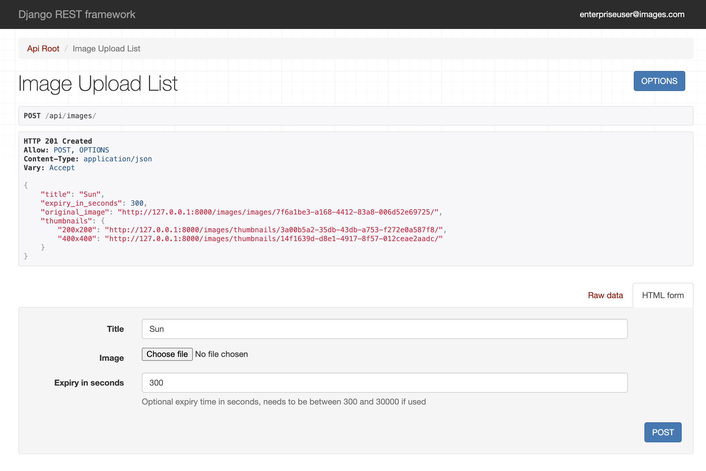

---

## Image List Endpoint with Browsable DRF

- Go to http://127.0.0.1:8000/api/get/images/, this endpoint is only accessible for users whose plan allows generating expiring images.
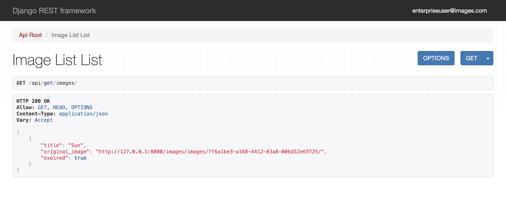
- If you access as a user without necessary permissions
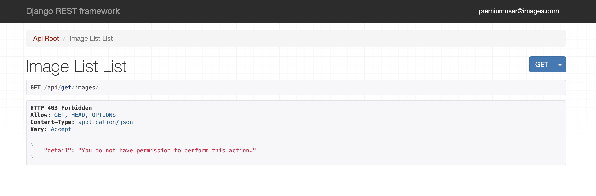
